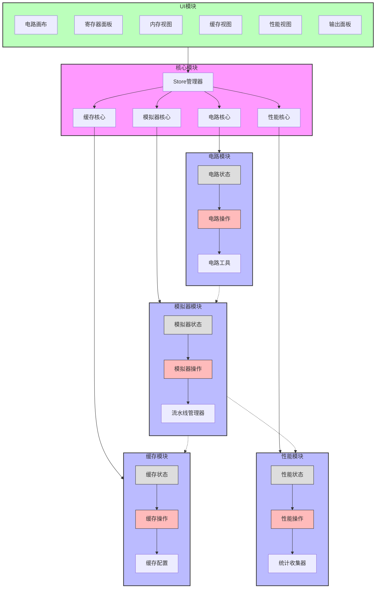

```mermaid
graph TB
    subgraph Core["核心模块"]
        direction TB
        StoreManager[Store管理器]
        CircuitCore[电路核心]
        SimulatorCore[模拟器核心]
        CacheCore[缓存核心]
        PerformanceCore[性能核心]
    end

    subgraph CircuitModule["电路模块"]
        direction TB
        CircuitState[电路状态]
        CircuitActions[电路操作]
        CircuitUtils[电路工具]
    end

    subgraph SimulatorModule["模拟器模块"]
        direction TB
        SimulatorState[模拟器状态]
        SimulatorActions[模拟器操作]
        PipelineManager[流水线管理器]
    end

    subgraph CacheModule["缓存模块"]
        direction TB
        CacheState[缓存状态]
        CacheActions[缓存操作]
        CacheConfig[缓存配置]
    end

    subgraph PerformanceModule["性能模块"]
        direction TB
        PerformanceState[性能状态]
        PerformanceActions[性能操作]
        StatsCollector[统计收集器]
    end

    subgraph UIModule["UI模块"]
        direction TB
        CircuitCanvas[电路画布]
        RegPanel[寄存器面板]
        MemoryView[内存视图]
        CacheView[缓存视图]
        PerformanceView[性能视图]
        OutputPanel[输出面板]
    end

    %% 核心模块与功能模块的关系
    StoreManager --> CircuitCore
    StoreManager --> SimulatorCore
    StoreManager --> CacheCore
    StoreManager --> PerformanceCore

    %% 功能模块内部关系
    CircuitState --> CircuitActions
    CircuitActions --> CircuitUtils
    CircuitCore --> CircuitModule

    SimulatorState --> SimulatorActions
    SimulatorActions --> PipelineManager
    SimulatorCore --> SimulatorModule

    CacheState --> CacheActions
    CacheActions --> CacheConfig
    CacheCore --> CacheModule

    PerformanceState --> PerformanceActions
    PerformanceActions --> StatsCollector
    PerformanceCore --> PerformanceModule

    %% UI模块与核心模块的关系
    UIModule --> StoreManager

    %% 模块间通信
    CircuitModule -.-> SimulatorModule
    SimulatorModule -.-> CacheModule
    SimulatorModule -.-> PerformanceModule

    %% 样式定义
    classDef core fill:#f9f,stroke:#333,stroke-width:2px
    classDef module fill:#bbf,stroke:#333,stroke-width:2px
    classDef ui fill:#bfb,stroke:#333,stroke-width:2px
    classDef state fill:#ddd,stroke:#333,stroke-width:1px
    classDef action fill:#fbb,stroke:#333,stroke-width:1px

    class Core core
    class CircuitModule,SimulatorModule,CacheModule,PerformanceModule module
    class UIModule ui
    class CircuitState,SimulatorState,CacheState,PerformanceState state
    class CircuitActions,SimulatorActions,CacheActions,PerformanceActions action
```
